<h4 style = "text-align:center; font-size:300%"> Master's in Data Science</h1>

Portfolio of projects I completed during the master's program in Data Science (2018-2020) though the University of Valencia 
 
### Table of Contents
1. [Active Learning](#al)
2. [Spark-MLlib](#mllib)
3. [Movie Recommendation System](#recomm)
4. [Tweets Capture](#tweets)
5. [Geospatial Data](#map)
6. [Data Visualization Python](#crime)
7. [Dash Web App](#dash)
8. [Investment Telegram Bot](#bot)

### Active Learning 
Combine active learning and diversity algorithms using a SVM as a base classifer.
**Active Learning algorithms:**
 
+ Margin Sampling
+ Multi-Class Label Uncertainty
+ Significance Space Construction
+ Normalized Entropy Query Bagging
 

**Diversity algorithms:**
 
+ Most Ambiguous and Orthogonal
+ Multiclass Level Uncertainty-angle-based Diversity
+ Diversity by clustering
 

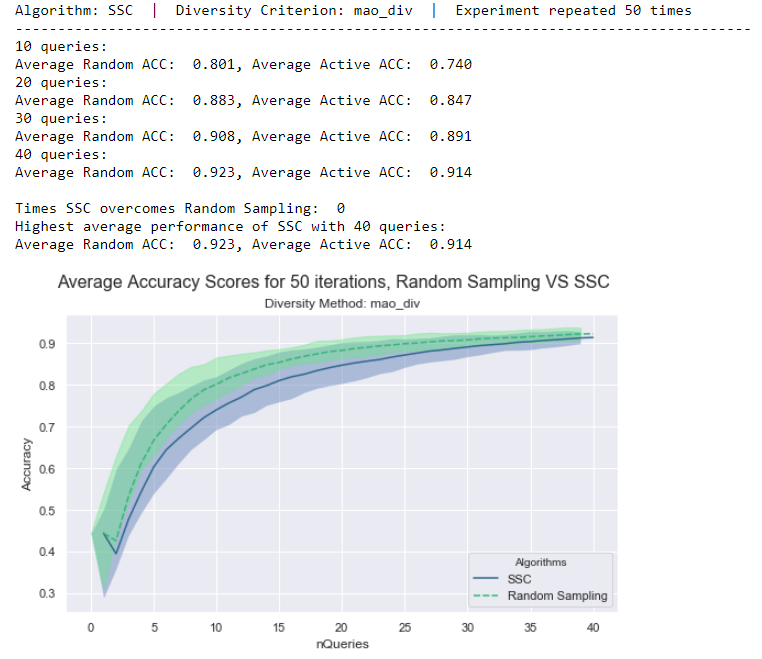

### Spark-MLlib 
Load, process and evaluate different clustering and classification algorithms provided by the Spark MLlib library on the classic MNIST data set using Watson Studio.

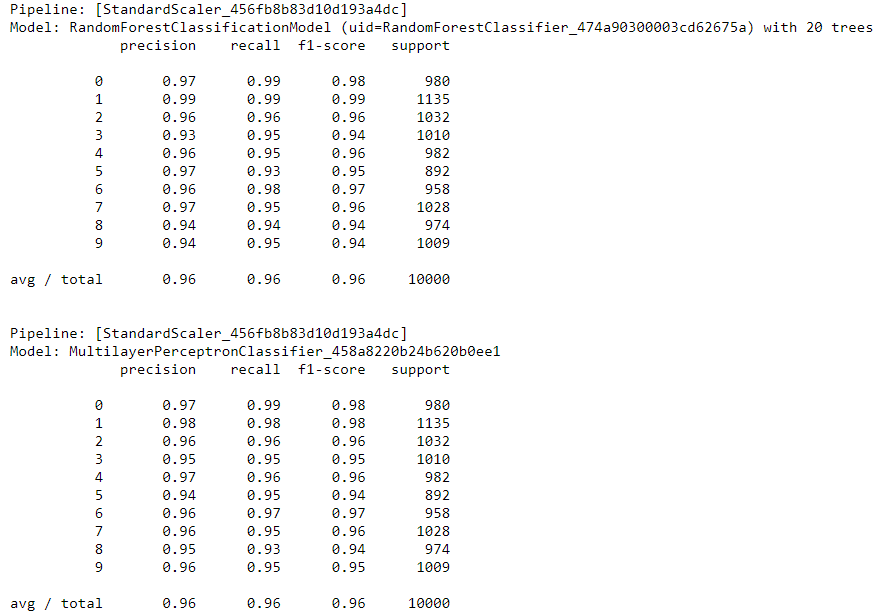

### Movie Recommendation System 
Develop a collaborative filtered type recommendation system usign the ALS algorithm (alternating least squares) provided by the Spark MLlib library.

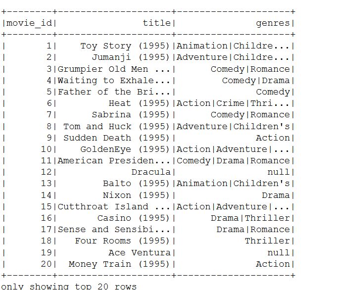

### Geospatial Data in R 
Visualization of geospatial data obtained from the Spanish National Statistics Office.

### Data Visualization in Python 
Simple visualization techniques of crime and nutrition data using Python libraries.

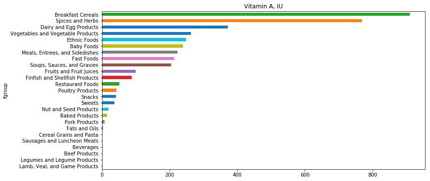
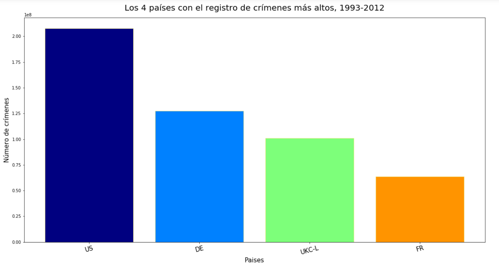

### Dash Project 
Example of an interactive web app using the Dash package and Python.

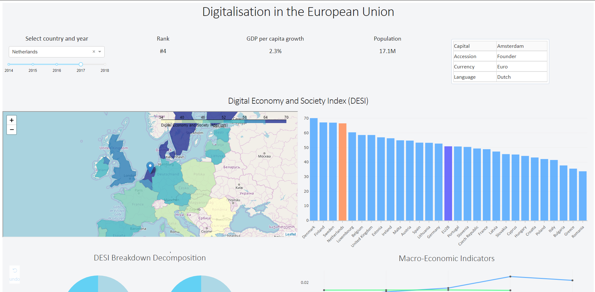
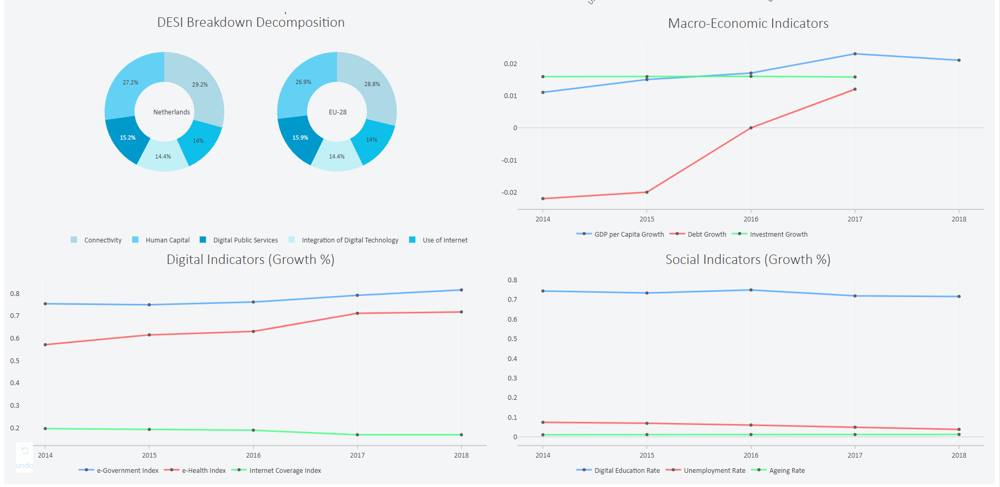

### Tweets Analysis 
Capture in real time, store, and process tweets in order to visualize in a map the origin of tweets in line with a movie premiere event. 

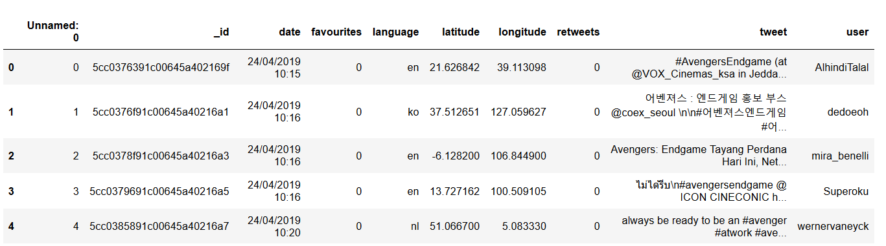
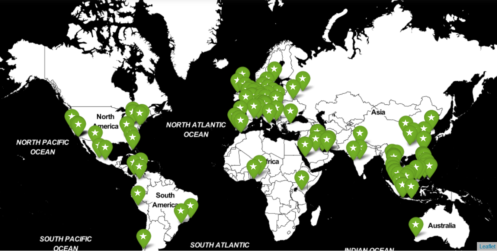

### Investment Telegram Bot 
Chatbot that acts as a personal investment assistant integrated into an instant messaging platform as Telegram.

 : @CDNG6_bot

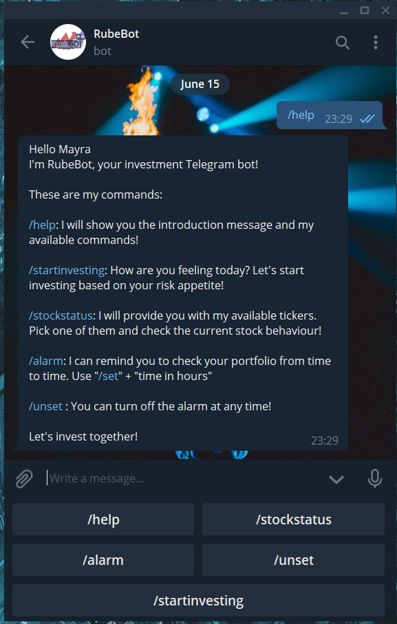
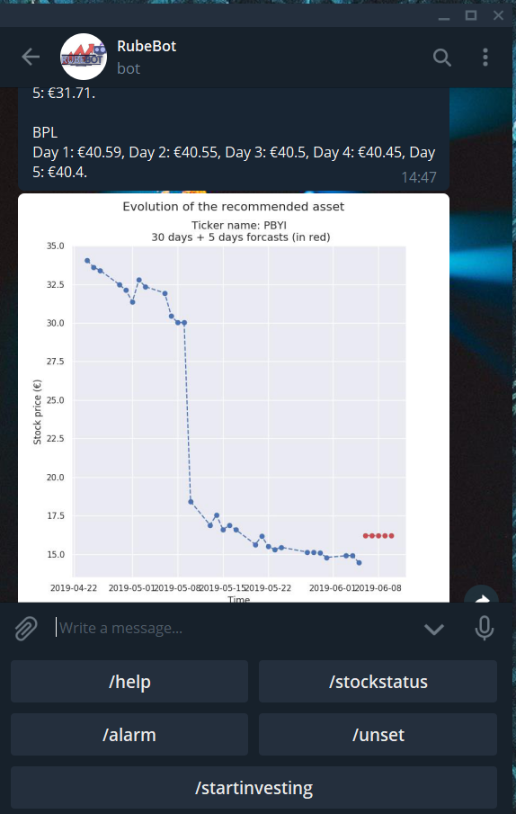
